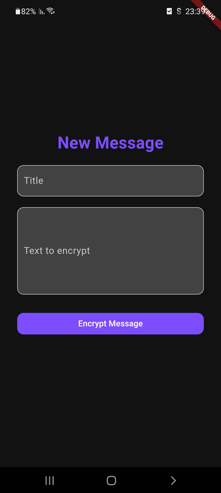
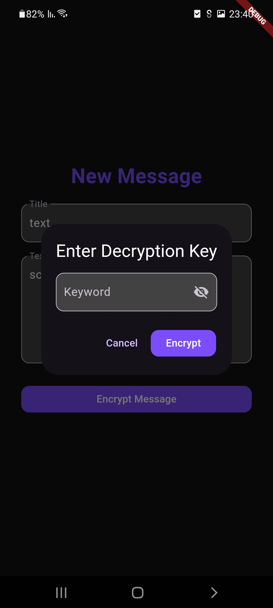
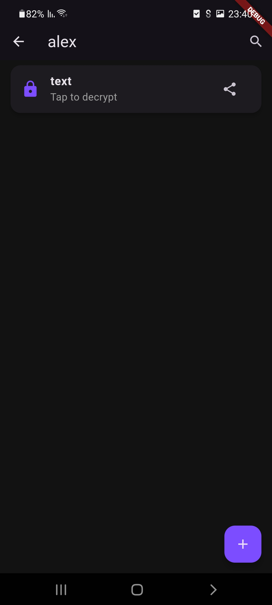
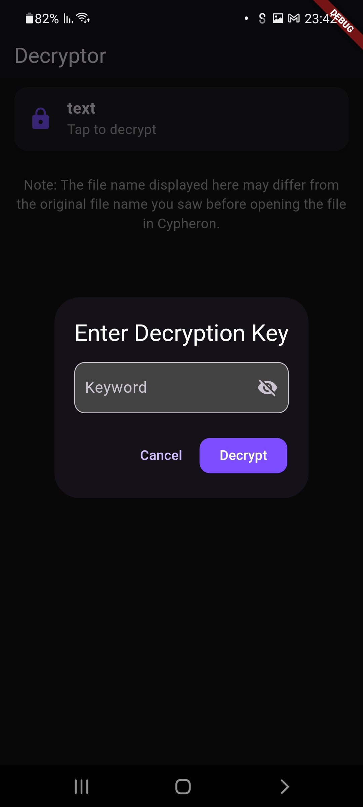
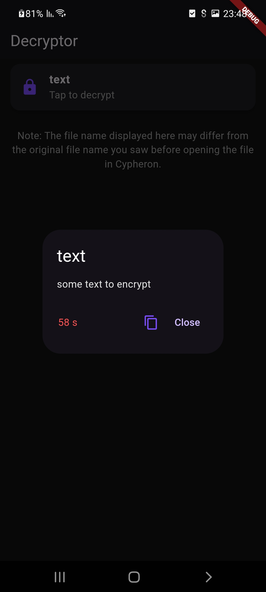

# Welcome to Cypheron

Cypheron is a secure and user-friendly app designed to help you send and receive encrypted messages. It's a tool for anyone who values privacy in their communication.

## Key Features

- **Secure Messaging**: Send messages that only the recipient can decrypt and read.
- **Easy-to-Use Interface**: Designed for simplicity, so anyone can use it without technical expertise.
- **File Encryption**: Encrypt and decrypt files effortlessly, ensuring your sensitive data remains private.
- **Contact Management**: Organize and manage your contacts directly within the app.

---

## How It Works

### 1. Create a Message
Write your message or select a file you want to send securely. You can choose a title for your message for easy identification later.

### 2. Encrypt
Use a secure key to lock your message or file. This ensures that only the person with the correct key can access the content.

### 3. Send
Share the encrypted message or file via your preferred platform, such as WhatsApp, email, or any other messaging app.

### 4. Decrypt
The recipient can unlock the encrypted message using the same key you used to encrypt it. The decryption process is simple and quick.

  
  

---

## Why Choose Cypheron?

- **Privacy First**: Your messages are encrypted, meaning only you and your recipient can access the content.
- **Control Over Data**: Keep your private messages safe, even if shared over public channels.
- **No Technical Knowledge Required**: Cypheron is designed for everyone, regardless of their tech background.

---

## License

Cypheron is proprietary software. The code, design, and all associated intellectual property are owned by the creator. You are not permitted to use, modify, or distribute the code without explicit written permission from the owner.

---

## Contact Us

If you have any questions, feedback, or need support, feel free to reach out.

---

Enjoy a safer way to communicate with Cypheron!
